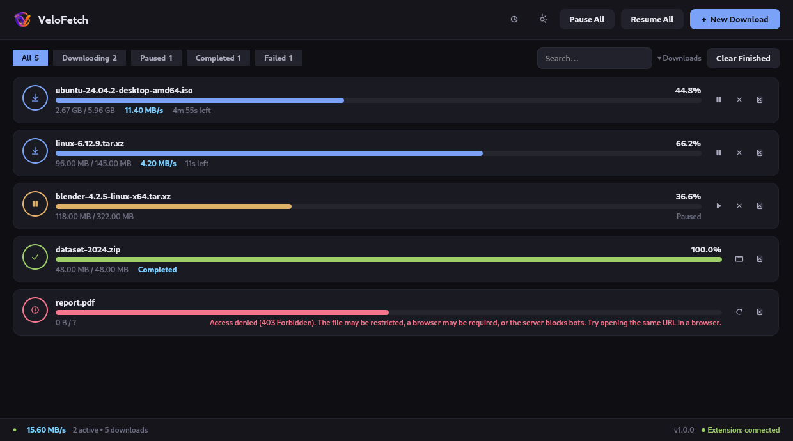
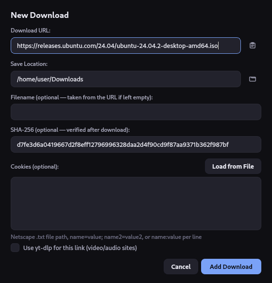
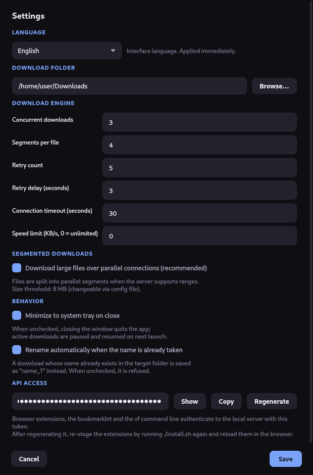
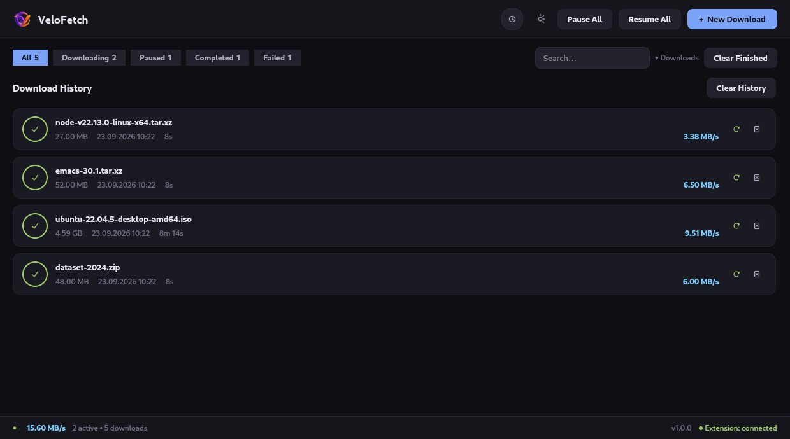

<div align="center">

# VeloFetch

**A fast, lightweight download manager for Linux — segmented downloads, resume, and browser integration.**

[](https://www.python.org/)
[](https://doc.qt.io/qtforpython/)
[-FCC624?logo=linux&logoColor=black)](#requirements)
[](LICENSE)
[](https://github.com/tkinali/VeloFetch/actions/workflows/ci.yml)

English · [Türkçe](README.tr.md)



</div>

---

## What it is

VeloFetch splits a download across several parallel connections, survives a restart without losing
progress, and takes downloads straight from your browser — including the cookies of the page you are
on, so login-protected files work too.

It is a desktop app, not a daemon with a web panel: a Qt 6 window, a system tray icon, and a CLI that
talks to the running instance. No Electron, no background service, no telemetry.

## Features

**Speed**
- **Segmented downloads** — files are fetched over parallel byte-range connections (4 by default) on
  servers that support HTTP Range, with a real `206` probe before committing to the strategy
- **Speed limit** — cap a download in KB/s when you need the bandwidth elsewhere. The cap applies per
  download, so N downloads running at once can use up to N times that rate
- **Concurrency control** — how many downloads run at once is yours to set; the rest queue

**Reliability**
- **Pause and resume** — HTTP Range means resuming continues where it stopped instead of starting over
- **Survives restarts** — progress is checkpointed to SQLite, and a segmented download keeps its
  per-segment offsets in a `.part.segments.json` sidecar, so closing the app is not a loss
- **Automatic retry** — connection errors back off exponentially; permanent failures (`401`, `403`,
  `410`) are not retried pointlessly
- **SHA-256 verification** — paste an expected checksum when adding; the result is shown on the card

**Integration**
- **Browser extensions** — right-click → *Download with VeloFetch* on Chrome, Chromium, Brave, Vivaldi
  and Firefox, with the page's cookies forwarded. The extension follows your browser's language
  (English and Turkish today)
- **Bookmarklet** — the same idea with nothing to install, in any browser. It can only forward what
  `document.cookie` exposes, so it does not carry `HttpOnly` session cookies — use the extension or a
  `cookies.txt` for those
- **Cookie support** — a Netscape `cookies.txt` file or raw cookie text, for sites that need a session
- **yt-dlp** — hand video and audio sites to `yt-dlp` when it is installed
- **CLI** — `vf add`, `vf list`, `vf ping`, `vf integration` against the running instance

**Interface**
- Dark Qt 6 UI with status filter chips, search, and per-card context menus
- Download history with details, re-download, and cleanup
- System tray: closing the window keeps downloads running in the background
- Desktop notification when a download finishes
- **English and Turkish**, following your system locale, switchable at runtime

**Security**
- The local API is bound to loopback and **protected by a mandatory token** — no token, no access
- No wildcard CORS, a `Host` check against DNS rebinding, and `http(s)`-only URLs
- The token lives in `~/.config/velofetch/config.json` with mode `0600` and is never committed

<div align="center">

 



</div>

## Requirements

| | |
|---|---|
| **OS** | Linux (X11 or Wayland) |
| **Python** | 3.10 or newer |
| **Qt** | Installed automatically as a pip dependency (`PySide6-Essentials`) — no system Qt packages needed |
| **Optional** | `yt-dlp` for video sites, `notify-send` for notifications, `xdg-open` to open files |

## Installation

### Automatic (recommended)

```bash
git clone https://github.com/tkinali/VeloFetch.git
cd VeloFetch
./install.sh
```

The script creates a virtualenv, installs the app, drops a `vf` launcher in `~/.local/bin`, registers
the application-menu entry and icons, generates your API token, and stages the browser extensions into
`~/.local/share/velofetch/browser/` ready to load. Like the app, the installer follows your system
locale (English and Turkish); force one with `./install.sh --lang=en`.

Remove everything again with:

```bash
./install.sh --uninstall
```

### With pip

```bash
pip install .            # yt-dlp included: pip install ".[media]"
vf
```

### From source, without installing

```bash
pip install -r requirements.txt
python -m vf
```

## Usage

Start the app from your application menu, or run `vf`.

### Adding a download

1. **➕ New Download** in the app — paste a URL, optionally set the filename, folder, SHA-256 checksum
   or cookies
2. **Right-click in your browser** → *Download with VeloFetch* (see [Browser integration](#browser-integration))
3. **From the terminal**, against the running app:

```bash
vf add https://example.com/file.iso
vf add https://example.com/file.iso --filename release.iso
vf add https://example.com/file.iso --cookies "session=abc123"
vf add https://example.com/file.iso --cookies ~/cookies.txt   # Netscape format
```

### CLI reference

| Command | What it does |
|---|---|
| `vf` | Launch the app (or focus the running window) |
| `vf add <url>` | Queue a download; `-f/--filename`, `-c/--cookies` |
| `vf list` | Show every download with its status and progress |
| `vf ping` | Check whether the app is running |
| `vf integration` | Print the browser-integration URL with your token embedded |

## Browser integration

VeloFetch listens on `127.0.0.1:9876` for the browser to hand it a download. Every request must carry
your API token, so a random web page cannot queue downloads behind your back.

### Bookmarklet — nothing to install

Run `vf integration` to get your personal URL, open it, and drag the **⬇ Download with VeloFetch**
button onto your bookmarks bar. Clicking it on any page sends that page's URL and cookies to VeloFetch.
Works in every browser. Note that a bookmarklet only sees `document.cookie`, so `HttpOnly` session
cookies are not included — for those, use the extension or a `cookies.txt`.

### Extension — for a right-click menu

`./install.sh` stages ready-to-load copies with your token already written in. Load them from the
staged directory, **not** from this repository — the copy in the repo deliberately carries no token and
the server will reject it.

**Chrome / Chromium / Brave / Vivaldi**
`chrome://extensions` → enable *Developer mode* → *Load unpacked* →
`~/.local/share/velofetch/browser/chromium`

**Firefox**
`about:debugging#/runtime/this-firefox` → *Load Temporary Add-on* →
`~/.local/share/velofetch/browser/firefox/manifest.json`
Unsigned add-ons are removed on every restart of release Firefox; the bookmarklet is the durable
option there.

### Downloads that need a login

Some sites (archive.org and friends) will only serve a file to a logged-in session:

1. Export the site's cookies with a *cookies.txt* browser extension
2. In VeloFetch's add dialog, use **Load from file** and pick it

Or use the browser extension, which reads the cookies through the browser's own API and therefore
forwards `HttpOnly` session cookies too.

## Settings

| Setting | Description | Default |
|---|---|---|
| Language | Interface language, applied immediately | System locale |
| Download folder | Where files are saved | `~/Downloads` |
| Concurrent downloads | How many run at the same time | 3 |
| Segments | Parallel connections per file | 4 |
| Retries | Attempts after a connection error | 5 |
| Retry delay | Base delay for exponential backoff (s) | 3 |
| Timeout | Connection timeout (s) | 30 |
| Speed limit | Per-download cap in KB/s, 0 = unlimited | 0 |
| Segmented downloads | Enable parallel byte ranges | On |
| Auto-rename | Rename instead of failing on a name collision | On |
| Minimize to tray | Closing the window hides it instead of quitting | On |
| API token | View, copy or regenerate the local API token | Generated on first run |

Settings live in `~/.config/velofetch/config.json` (mode `0600`), in the same directory as the
`downloads.db` history database. Advanced keys not exposed in the GUI — such as `segmented_min_size`
(the 8 MB floor below which segmenting is skipped) and `chunk_size` — can be edited there.

> **After regenerating the API token**, re-run `./install.sh` so the staged browser extensions pick up
> the new value.

## Security model

The local HTTP server is the only way in, and it is deliberately narrow:

- Bound to `127.0.0.1` only, never a public interface
- Every route requires the token, compared in constant time. There are exactly two exceptions: `/ping`,
  which the single-instance guard needs and which returns nothing sensitive, and the `OPTIONS`
  preflight, which by design cannot carry a header and only advertises method names
- Requests whose `Host` header is not loopback are rejected, blocking DNS rebinding
- `Access-Control-Allow-Origin` is never `*`; the origin is echoed back on authenticated responses and
  on that preflight
- Only `http://` and `https://` URLs are accepted, and request bodies are capped at 1 MiB

The token is generated on first run, stored mode `0600`, and written into the staged extension copies
under `~/.local/share/velofetch/` — never into a file in this repository. A test in the suite fails if
a `VELFETCH_TOKEN` or `api_token` assignment with a long opaque value appears in a tracked file.

## Development

```bash
git clone https://github.com/tkinali/VeloFetch.git
cd VeloFetch
pip install -e ".[dev]"

make test      # pytest, headless
make lint      # ruff
```

Tests run offscreen (`QT_QPA_PLATFORM=offscreen`), so no display is required. CI runs the suite and the
linter on Python 3.10, 3.12 and 3.14.

### Project layout

```
VeloFetch/
├── vf/
│   ├── __main__.py           # entry point: GUI, CLI, single-instance guard
│   ├── i18n.py               # translation core
│   ├── locales/              # language packs (en, tr, …) + the registry
│   ├── assets/               # application icons (shipped in the wheel)
│   ├── core/
│   │   ├── config.py         # settings + API token (~/.config/velofetch)
│   │   ├── database.py       # SQLite persistence
│   │   ├── downloader.py     # engine: segmented, resume, retry, throttle
│   │   └── server.py         # local HTTP API for the browser and CLI
│   ├── qtgui/                # PySide6 interface
│   │   ├── app.py            # QApplication bootstrap
│   │   ├── main_window.py    # main window
│   │   ├── add_dialog.py     # add-download dialog
│   │   ├── settings_dialog.py
│   │   ├── download_card.py  # a download in the list
│   │   ├── history_card.py   # a row in the history page
│   │   ├── details_dialog.py # per-download details
│   │   ├── icons.py          # themed icons with painted fallbacks
│   │   ├── bridge.py         # background thread → GUI signal bridge
│   │   ├── tray.py           # system tray
│   │   └── theme.py          # QSS dark theme
│   └── utils/helpers.py
├── browser/
│   ├── chromium/             # Chrome-based extension
│   └── firefox/              # Firefox extension
├── tests/                    # pytest suite
├── install.sh                # installer / uninstaller
└── pyproject.toml
```

### Adding a language

1. Copy `vf/locales/en.py` to `vf/locales/<code>.py` and translate the values
2. Register it in `vf/locales/__init__.py`:

```python
from . import de
i18n.register("de", "Deutsch", de.STRINGS)
```

The test suite enforces that every language pack has exactly the same keys and placeholders as English,
so a half-finished translation fails the tests rather than silently falling back.

## Troubleshooting

| Symptom | Fix |
|---|---|
| Status bar shows *Extension: off* | Something else already holds port 9876 — find it with `ss -ltnp \| grep 9876` (it may be a stale VeloFetch), close it and reopen. |
| Extension reports an invalid token | Load the extension from `~/.local/share/velofetch/browser/<name>/`, not from this repo. Re-run `./install.sh` after regenerating the token. |
| Extension does nothing | VeloFetch must be running — start it with `vf`, then check with `vf ping`. |
| Nothing renders on Wayland | Try XWayland: `QT_QPA_PLATFORM=xcb vf` |
| A download will not resume | The server may not support HTTP Range; VeloFetch falls back to a single stream and restarts the transfer. |

## Contributing

Issues and pull requests are welcome. Fork, branch, make the change, make sure `make test` and
`make lint` are green, then open a PR.

## License

MIT — see [LICENSE](LICENSE).
