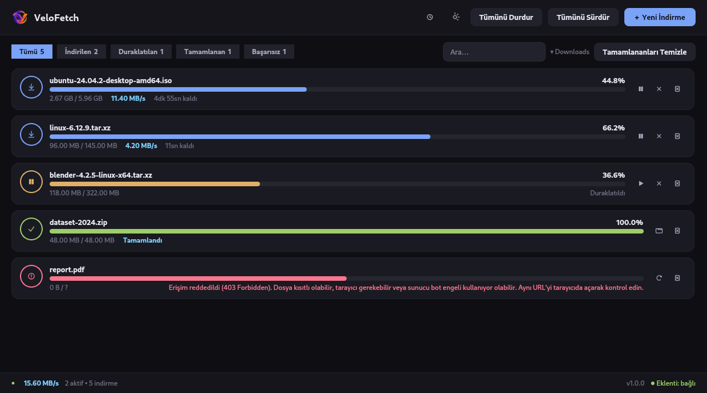
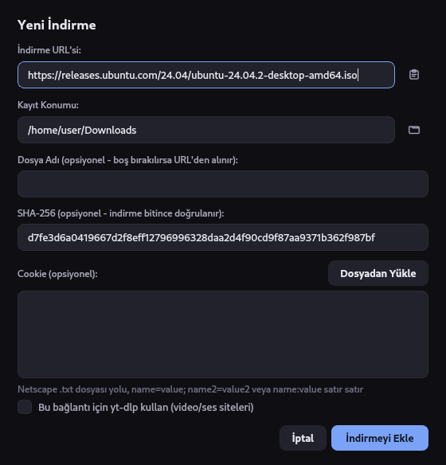
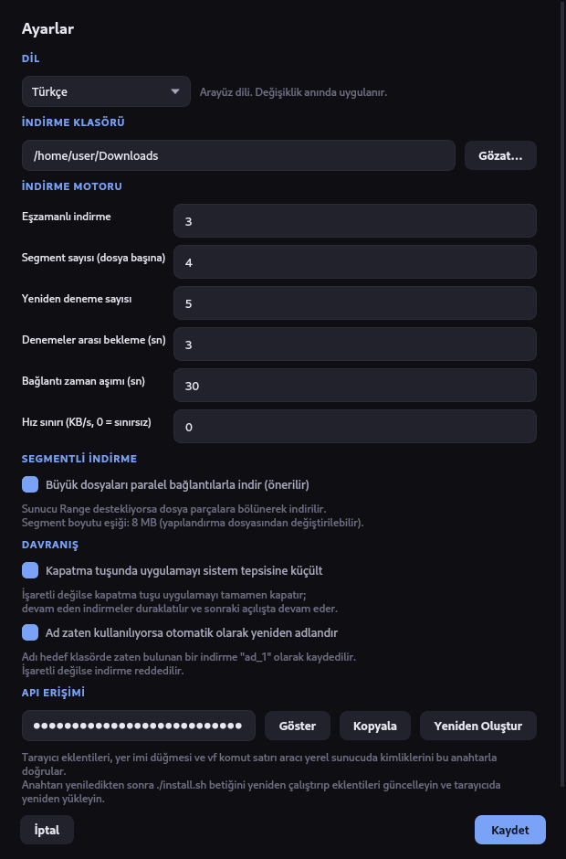
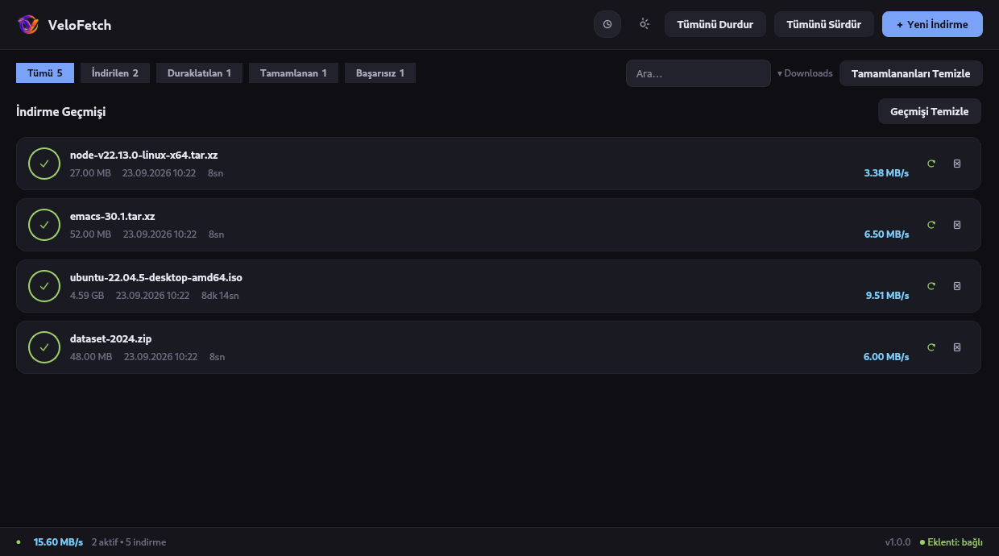

<div align="center">

# VeloFetch

**Linux için hızlı ve hafif bir indirme yöneticisi — segmentli indirme, kaldığı yerden devam ve tarayıcı entegrasyonu.**

[](https://www.python.org/)
[](https://doc.qt.io/qtforpython/)
[-FCC624?logo=linux&logoColor=black)](#gereksinimler)
[](LICENSE)
[](https://github.com/tkinali/VeloFetch/actions/workflows/ci.yml)

[English](README.md) · Türkçe



</div>

---

## Nedir

VeloFetch bir dosyayı paralel bağlantılara bölerek indirir, uygulama kapansa bile ilerlemeyi kaybetmez
ve indirmeleri doğrudan tarayıcınızdan alır — bulunduğunuz sayfanın cookie'leriyle birlikte, yani
oturum isteyen dosyalar da çalışır.

Bu bir masaüstü uygulaması; web paneli olan bir servis değil: Qt 6 penceresi, sistem tepsisi ikonu ve
çalışan örneğe bağlanan bir CLI. Electron yok, arka plan servisi yok, telemetri yok.

## Özellikler

**Hız**
- **Segmentli indirme** — HTTP Range destekleyen sunucularda dosya paralel bayt aralıklarıyla
  (varsayılan 4) indirilir; stratejiye geçmeden önce gerçek bir `206` denemesi yapılır
- **Hız sınırı** — bant genişliğine başka yerde ihtiyacınız olduğunda indirmeyi KB/s cinsinden
  sınırlayın. Sınır indirme başınadır; aynı anda N indirme çalışıyorsa toplam hız N katına çıkabilir
- **Eşzamanlılık denetimi** — aynı anda kaç indirme çalışacağını siz belirlersiniz, gerisi kuyruğa girer

**Güvenilirlik**
- **Duraklat ve devam et** — HTTP Range sayesinde devam etmek baştan başlamak değil, kaldığı yerden
  sürdürmek demek
- **Yeniden başlatmaya dayanıklı** — ilerleme SQLite'a işlenir, segmentli bir indirme ise segment
  konumlarını `.part.segments.json` yan dosyasında tutar; uygulamayı kapatmak kayıp değildir
- **Otomatik yeniden deneme** — bağlantı hataları üstel beklemeyle tekrarlanır; kalıcı hatalar
  (`401`, `403`, `410`) boşuna denenmez
- **SHA-256 doğrulama** — eklerken beklenen özeti yapıştırın; sonuç kartın üzerinde görünür

**Entegrasyon**
- **Tarayıcı eklentileri** — Chrome, Chromium, Brave, Vivaldi ve Firefox'ta sağ tık →
  *VeloFetch ile İndir*, sayfanın cookie'leri de aktarılarak. Eklenti tarayıcınızın dilini izler
  (şimdilik Türkçe ve İngilizce)
- **Yer imi (bookmarklet)** — aynı fikir, hiçbir kurulum gerektirmeden, her tarayıcıda. Yalnızca
  `document.cookie` ile görünen cookie'leri iletebilir, yani `HttpOnly` oturum cookie'lerini taşımaz —
  onlar için eklentiyi veya bir `cookies.txt` dosyasını kullanın
- **Cookie desteği** — oturum isteyen siteler için Netscape `cookies.txt` dosyası veya ham cookie metni
- **yt-dlp** — kuruluysa video ve ses sitelerini `yt-dlp`'ye devredin
- **CLI** — çalışan örneğe karşı `vf add`, `vf list`, `vf ping`, `vf integration`

**Arayüz**
- Koyu Qt 6 arayüzü; durum filtreleri, arama ve her kartın kendi sağ tık menüsü
- Ayrıntı, yeniden indirme ve temizleme içeren indirme geçmişi
- Sistem tepsisi: pencereyi kapatmak indirmeleri arka planda sürdürür
- İndirme bitince masaüstü bildirimi
- **Türkçe ve İngilizce**, sistem dilinizi izler, çalışırken değiştirilebilir

**Güvenlik**
- Yerel API yalnızca loopback'e bağlıdır ve **zorunlu bir token ile korunur** — token yoksa erişim yok
- Joker CORS yok, DNS rebinding'e karşı `Host` denetimi var, yalnızca `http(s)` URL'leri kabul edilir
- Token `~/.config/velofetch/config.json` içinde `0600` izinleriyle durur ve hiçbir zaman depoya girmez

<div align="center">

 



</div>

## Gereksinimler

| | |
|---|---|
| **İşletim sistemi** | Linux (X11 veya Wayland) |
| **Python** | 3.10 veya üzeri |
| **Qt** | pip bağımlılığı olarak otomatik kurulur (`PySide6-Essentials`) — ayrıca sistem Qt paketi gerekmez |
| **İsteğe bağlı** | Video siteleri için `yt-dlp`, bildirimler için `notify-send`, dosya açmak için `xdg-open` |

## Kurulum

### Otomatik (önerilen)

```bash
git clone https://github.com/tkinali/VeloFetch.git
cd VeloFetch
./install.sh
```

Betik bir sanal ortam oluşturur, uygulamayı kurar, `~/.local/bin` içine `vf` başlatıcısını bırakır,
uygulama menüsü girdisini (`.desktop`) ve ikonları kaydeder, API token'ınızı üretir ve tarayıcı
eklentilerini yüklemeye hazır biçimde `~/.local/share/velofetch/browser/` altına yerleştirir.

Her şeyi kaldırmak için:

```bash
./install.sh --uninstall
```

### pip ile

```bash
pip install .            # yt-dlp dahil için: pip install ".[media]"
vf
```

### Kurmadan, kaynaktan

```bash
pip install -r requirements.txt
python -m vf
```

## Kullanım

Uygulamayı menüden başlatın veya `vf` komutunu çalıştırın.

### İndirme ekleme

1. Uygulamada **➕ Yeni İndirme** — URL'yi yapıştırın; isterseniz dosya adı, klasör, SHA-256 özeti veya
   cookie girin
2. **Tarayıcıda sağ tık** → *VeloFetch ile İndir* (bkz. [Tarayıcı entegrasyonu](#tarayıcı-entegrasyonu))
3. **Terminalden**, çalışan uygulamaya:

```bash
vf add https://example.com/file.iso
vf add https://example.com/file.iso --filename surum.iso
vf add https://example.com/file.iso --cookies "session=abc123"
vf add https://example.com/file.iso --cookies ~/cookies.txt   # Netscape biçimi
```

### CLI komutları

| Komut | Yaptığı iş |
|---|---|
| `vf` | Uygulamayı başlatır (çalışıyorsa pencereyi öne getirir) |
| `vf add <url>` | İndirme kuyruğa ekler; `-f/--filename`, `-c/--cookies` |
| `vf list` | Tüm indirmeleri durum ve ilerlemeleriyle listeler |
| `vf ping` | Uygulamanın çalışıp çalışmadığını kontrol eder |
| `vf integration` | Token'ınız gömülü tarayıcı entegrasyonu URL'sini yazdırır |

## Tarayıcı entegrasyonu

VeloFetch, tarayıcının indirme göndermesi için `127.0.0.1:9876` adresini dinler. Her istek API
token'ınızı taşımak zorundadır; böylece rastgele bir web sayfası arkanızdan indirme kuyruğa ekleyemez.

### Yer imi — kurulum gerektirmez

`vf integration` komutuyla kişisel adresinizi alın, açın ve **⬇ VeloFetch ile İndir** butonunu yer imi
çubuğunuza sürükleyin. Herhangi bir sayfada bu yer imine tıklamak, o sayfanın URL'sini ve cookie'lerini
VeloFetch'e gönderir. Her tarayıcıda çalışır. Bir yer imi yalnızca `document.cookie` içeriğini
görebildiği için `HttpOnly` oturum cookie'leri aktarılmaz — onlar için eklentiyi veya bir `cookies.txt`
dosyasını kullanın.

### Eklenti — sağ tık menüsü için

`./install.sh` token'ınız yazılmış, yüklenmeye hazır kopyalar hazırlar. Eklentiyi **bu depodan değil**,
hazırlanan dizinden yükleyin — depodaki kopya kasıtlı olarak token taşımaz ve sunucu onu reddeder.

**Chrome / Chromium / Brave / Vivaldi**
`chrome://extensions` → *Geliştirici modu*'nu açın → *Paketlenmemiş öğe yükle* →
`~/.local/share/velofetch/browser/chromium`

**Firefox**
`about:debugging#/runtime/this-firefox` → *Geçici Eklenti Yükle* →
`~/.local/share/velofetch/browser/firefox/manifest.json`
Yayın sürümü Firefox'ta imzasız eklentiler her yeniden başlatmada silinir; kalıcı çözüm yer imi
düğmesidir.

### Oturum gerektiren indirmeler

Bazı siteler (archive.org ve benzerleri) dosyayı yalnızca oturum açmış bir kullanıcıya verir:

1. Sitenin cookie'lerini bir *cookies.txt* tarayıcı eklentisiyle dışa aktarın
2. VeloFetch'in ekleme penceresinde **Dosyadan Yükle** ile seçin

Ya da cookie'leri tarayıcının kendi API'si üzerinden okuyan, dolayısıyla `HttpOnly` oturum
cookie'lerini de ileten tarayıcı eklentisini kullanın.

## Ayarlar

| Ayar | Açıklama | Varsayılan |
|---|---|---|
| Dil | Arayüz dili, anında uygulanır | Sistem dili |
| İndirme klasörü | Dosyaların kaydedileceği yer | `~/Downloads` |
| Eşzamanlı indirme | Aynı anda kaç indirme çalışacağı | 3 |
| Segment sayısı | Dosya başına paralel bağlantı | 4 |
| Yeniden deneme | Bağlantı hatasından sonraki deneme sayısı | 5 |
| Deneme aralığı | Üstel beklemenin taban süresi (sn) | 3 |
| Zaman aşımı | Bağlantı zaman aşımı (sn) | 30 |
| Hız sınırı | KB/s cinsinden indirme başına sınır, 0 = sınırsız | 0 |
| Segmentli indirme | Paralel bayt aralıklarını aç/kapat | Açık |
| Otomatik yeniden adlandırma | Ad çakışmasında hata vermek yerine yeniden adlandır | Açık |
| Tepsiye küçült | Pencereyi kapatmak çıkmak yerine gizler | Açık |
| API token | Yerel API token'ını gör, kopyala veya yenile | İlk çalıştırmada üretilir |

Ayarlar, geçmiş veritabanı `downloads.db` ile aynı dizinde, `~/.config/velofetch/config.json`
dosyasında (`0600` izinleriyle) durur. GUI'de görünmeyen ileri düzey anahtarlar — `segmented_min_size`
(altında segmentlemenin atlandığı 8 MB eşiği) ve `chunk_size` gibi — buradan düzenlenebilir.

> **API token'ını yeniledikten sonra**, hazırlanan tarayıcı eklentilerinin yeni değeri alması için
> `./install.sh` komutunu tekrar çalıştırın.

## Güvenlik modeli

Yerel HTTP sunucusu içeri açılan tek kapıdır ve bilinçli olarak dardır:

- Yalnızca `127.0.0.1` üzerinde dinler, hiçbir zaman genel bir arayüzde değil
- Her uç nokta zorunlu token ister ve token sabit zamanlı karşılaştırmayla doğrulanır. Tam olarak iki
  istisna var: tek-örnek korumasının ihtiyaç duyduğu ve hassas hiçbir şey döndürmeyen `/ping`, bir de
  tasarımı gereği başlık taşıyamayan ve yalnızca metot adlarını duyuran `OPTIONS` ön kontrol isteği
- `Host` başlığı loopback olmayan istekler reddedilir; bu DNS rebinding'i engeller
- `Access-Control-Allow-Origin` asla `*` değildir; origin, kimliği doğrulanmış yanıtlarda ve o ön
  kontrol isteğinde yankılanır
- Yalnızca `http://` ve `https://` URL'leri kabul edilir, istek gövdesi 1 MiB ile sınırlıdır

Token ilk çalıştırmada üretilir, `0600` izinleriyle saklanır ve hazırlanan eklenti kopyalarına
`~/.local/share/velofetch/` altında yazılır — asla bu depodaki bir dosyaya değil. Test paketindeki bir
kontrol, izlenen bir dosyada `VELFETCH_TOKEN` veya `api_token` ataması olarak uzun bir token görürse
testi, dolayısıyla CI'ı düşürür.

## Geliştirme

```bash
git clone https://github.com/tkinali/VeloFetch.git
cd VeloFetch
pip install -e ".[dev]"

make test      # pytest, ekransız
make lint      # ruff
```

Testler ekransız çalışır (`QT_QPA_PLATFORM=offscreen`), bu yüzden bir ekrana ihtiyaç yoktur. CI, test
paketini ve linter'ı Python 3.10, 3.12 ve 3.14 üzerinde çalıştırır.

### Proje yapısı

```
VeloFetch/
├── vf/
│   ├── __main__.py           # giriş noktası: GUI, CLI, tek-örnek koruması
│   ├── i18n.py               # çeviri çekirdeği
│   ├── locales/              # dil paketleri (en, tr, …) ve kayıt defteri
│   ├── assets/               # uygulama ikonları (wheel içinde gelir)
│   ├── core/
│   │   ├── config.py         # ayarlar + API token (~/.config/velofetch)
│   │   ├── database.py       # SQLite kalıcı depolama
│   │   ├── downloader.py     # motor: segmentli, devam, yeniden deneme, hız sınırı
│   │   └── server.py         # tarayıcı ve CLI için yerel HTTP API
│   ├── qtgui/                # PySide6 arayüzü
│   │   ├── app.py            # QApplication başlatma
│   │   ├── main_window.py    # ana pencere
│   │   ├── add_dialog.py     # indirme ekleme penceresi
│   │   ├── settings_dialog.py
│   │   ├── download_card.py  # listedeki bir indirme
│   │   ├── history_card.py   # geçmiş sayfasındaki bir satır
│   │   ├── details_dialog.py # indirme ayrıntıları
│   │   ├── icons.py          # tema ikonları ve çizilmiş yedekleri
│   │   ├── bridge.py         # arka plan iş parçacığı → GUI sinyal köprüsü
│   │   ├── tray.py           # sistem tepsisi
│   │   └── theme.py          # QSS koyu tema
│   └── utils/helpers.py
├── browser/
│   ├── chromium/             # Chrome tabanlı eklenti
│   └── firefox/              # Firefox eklentisi
├── tests/                    # pytest paketi
├── install.sh                # kurucu / kaldırıcı
└── pyproject.toml
```

### Yeni dil ekleme

1. `vf/locales/en.py` dosyasını `vf/locales/<kod>.py` olarak kopyalayın ve değerleri çevirin
2. `vf/locales/__init__.py` içinde kaydedin:

```python
from . import de
i18n.register("de", "Deutsch", de.STRINGS)
```

Test paketi, her dil paketinin İngilizce ile birebir aynı anahtarlara ve yer tutuculara sahip olmasını
zorunlu kılar; böylece yarım kalmış bir çeviri sessizce İngilizceye düşmek yerine testi kırar.

## Sorun giderme

| Belirti | Çözüm |
|---|---|
| Durum çubuğunda *Eklenti: kapalı* | 9876 portunu başka bir şey tutuyor — `ss -ltnp \| grep 9876` ile bulun (takılı kalmış bir VeloFetch olabilir), kapatıp yeniden açın. |
| Eklenti geçersiz token diyor | Eklentiyi bu depodan değil, `~/.local/share/velofetch/browser/<ad>/` dizininden yükleyin. Token'ı yenilediyseniz `./install.sh` komutunu tekrar çalıştırın. |
| Eklenti hiçbir şey yapmıyor | VeloFetch çalışıyor olmalı — `vf` ile başlatın, `vf ping` ile doğrulayın. |
| Wayland'de hiçbir şey görünmüyor | XWayland deneyin: `QT_QPA_PLATFORM=xcb vf` |
| Bir indirme devam etmiyor | Sunucu HTTP Range desteklemiyor olabilir; VeloFetch tek akışa düşer ve aktarımı baştan başlatır. |

## Katkı

Issue ve pull request'ler memnuniyetle karşılanır. Fork edin, dal açın, değişikliği yapın, `make test`
ve `make lint` çıktılarının temiz olduğundan emin olun ve PR açın.

## Lisans

MIT — bkz. [LICENSE](LICENSE).
